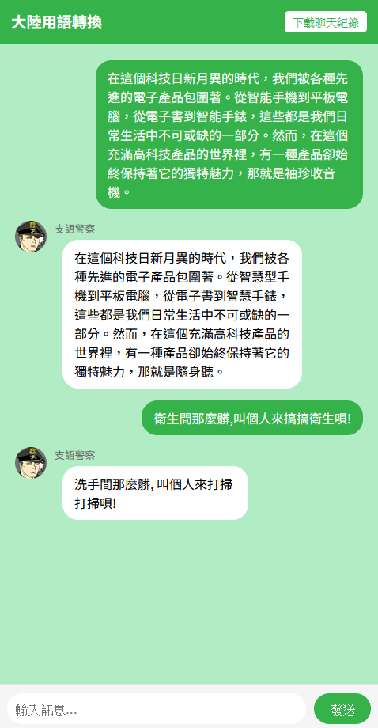
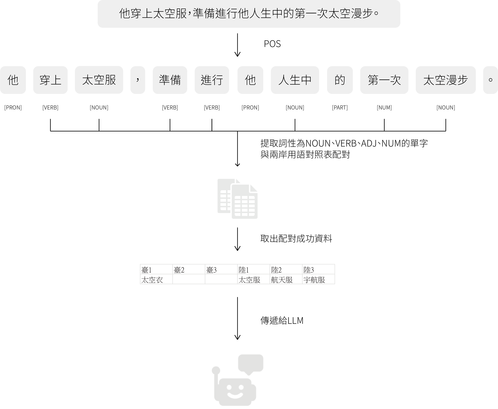

# **Introduction**


**MandarinDialectTranslator**是一個結合LLM及RAG來實現的翻譯大陸用語的可視化界面。使用者可以輕易地使用此程式來翻譯大陸用語及製作大陸用語翻譯資料集。

### **Function**

- 將大陸用語翻譯成台灣用語
- 下載聊天紀錄

### **RAG Architecture**



1. 首先對輸入的文字進行POS(詞性標註)。
2. 提取出詞性為名詞、動詞、形容詞、量詞的單字。
3. 對大陸用語資料集進行比對。
4. 提取出與之匹配的資料。
5. 傳遞給LLM

# **Installation**

### **Install via GitHub**

**Clone the repo:**

```python
git clone git@github.com:qaz45647/MandarinDialectTranslator.git
```

```python
cd MandarinDialectTranslator
```

**Create a conda environment:**

```python
conda create -n MandarinDialectTranslator python=3.9
conda activate MandarinDialectTranslator
```

**Use pip to install required packages:**

```python
pip install -r requirements.txt
```

# **Usage**


### **Execute program**

**Move to MandarinDialectTranslator folder:**

```python
cd MandarinDialectTranslator
```

**Set gemini key(api_key.txt)**

**Execute app.py:**

```python
python app.py
```

### Modify dataset

翻譯的準確性取決於LLM本身的知識及資料集的內容。欲擴充資料集，使用者可於ch.csv中進行新增或修改資料。

### **Implemented Components**

**models:**

- gemini-1.5-flash
- zh_core_web_trf

**dataset:**

- [**g0v / moedict-data-csld**](https://github.com/g0v/moedict-data-csld)
